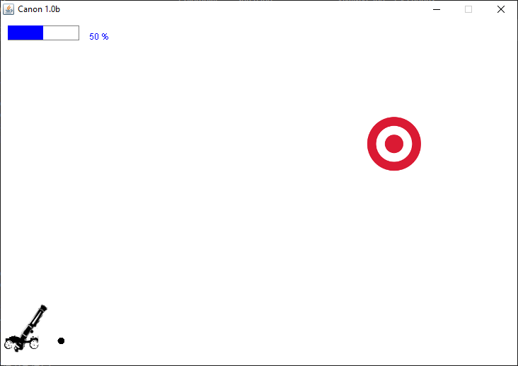
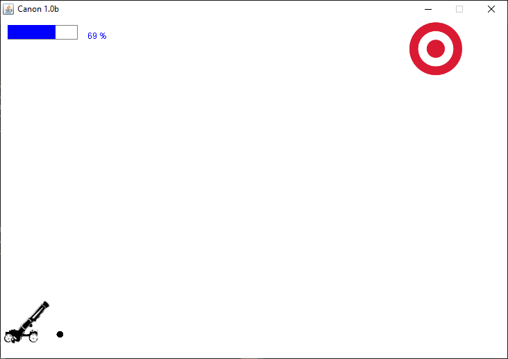
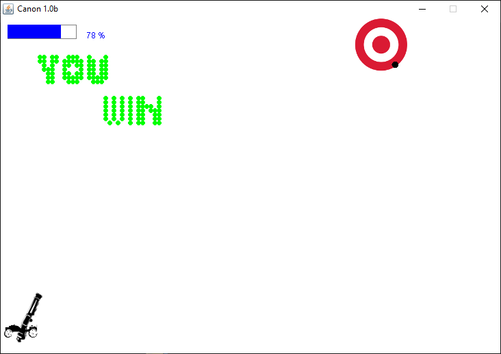

# First Cannon
 First minimally presentable code of my life. Related to AlPro class in 14A.

## The game
 Its a cannon game with angle and power control(arrows). You have 3 shots to win the game. 
 

## Compiling/run instructions
`bash
javac *.java
java JogoCanon
`

